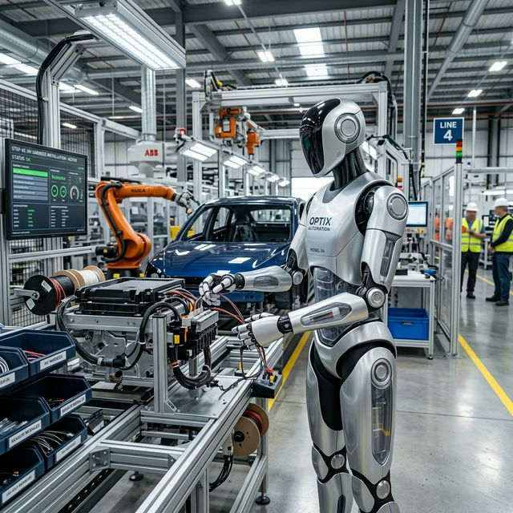
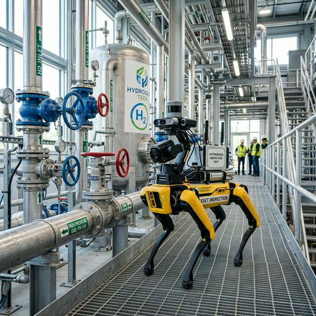
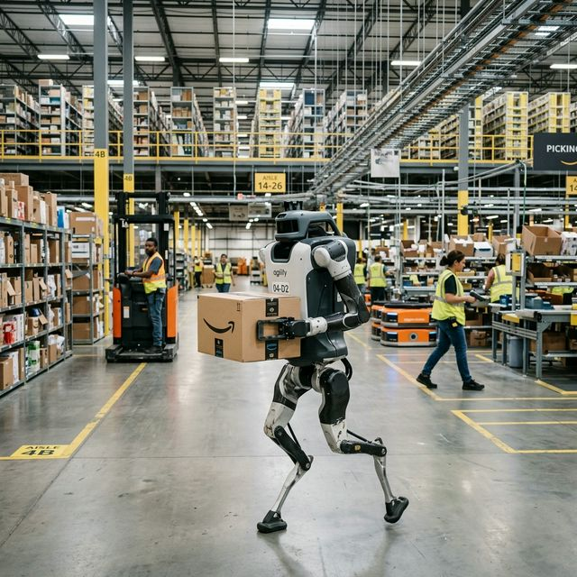
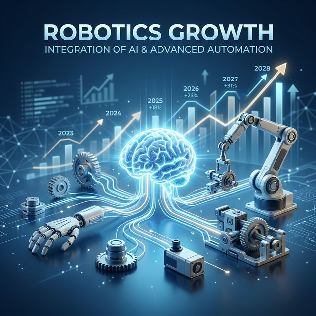

# Robotik Yarışı Başladı: Yapay Zeka Fabrikaya, Depoya ve Sokağa İniyor

**1. Giriş: Neden Robotik Şimdi Hızlandı?**
Uzun yıllar boyunca robotik endüstrisi mekanik donanım tarafında harikalar yarattı, ancak bu makinelere duruma göre adapte olabilen esnek bir zeka veremedi. Robotların kusursuz bedenleri vardı, ama akılları kapalı sistemler içinde kodlanmış senaryolarla sınırlıydı. Büyülü an, algoritmaların bilgisayar ekranlarını aşıp fiziksel donanımlara geçmesiyle yaşandı.

Büyük Dil Modelleri (LLM'ler), gelişmiş görme (vision) sistemleri, ucuzlayan ve küçülen lidar/sensör donanımları, yüksek enerji yoğunluklu bataryalar ve **Nvidia Omniverse** gibi sanal simülasyon ortamları aynı potada eridi. Bu birleşime günümüzde **"Physical AI" (Fiziksel Yapay Zeka)** diyoruz. Robotlar artık mühendisler tarafından satır satır kodlanmıyor; videolar izleyerek, kendi hatalarından öğrenerek (*reinforcement learning*) tıpkı bir insan gibi deneyim yoluyla kapasitelerini artırıyorlar. Yapay zeka ekrandan çıkıyor ve direkt olarak fiziksel dünyaya dokunuyor.

**2. Robotik Alanındaki Ana Kategoriler**
Robotik devrimini tek başına insana benzeyen makineler olarak okumak resmi küçültür. Sahada farklı sorunlara odaklanmış spesifik form faktörleri var:
*   **Humanoid (İnsansı) Robotlar:** Fabrika, inşaat veya insan ölçülerine göre tasarlanmış her alana uyum sağlayabilen esnek platformlar.
*   **Dört Ayaklı (Quadruped) Robotlar:** Zorlu arazilerde arama kurtarma, merdiven çıkma, tesis denetleme sistemleri.
*   **Depo ve Lojistik Robotları:** Yükleri otonom olarak sıralayan, depolama merkezlerinin yorulmaz işçileri.
*   **Endüstriyel Robot Kolları:** Güvenlik kafeslerinden çıkıp insanlarla yan yana güvenle çalışan (*cobot*) akıllı versiyonlar.
*   **Otonom Tarım Robotları:** Hassas tohumlama, bitki bazlı hedefli ilaçlama ve otonom hasat teknosistemleri.

**3. Amerika Cephesi: Yazılım, Sermaye ve Çip Gücü**
Amerikan şirketleri sektördeki yapay zeka sıçramasını silikon mimarisi, derin sermaye havuzu ve yenilikçi start-up ekosistemiyle yönetiyor.

*   **Tesla Optimus:** Elon Musk'ın "araba üreten firmadan, makine üreten firmaya" geçiş vizyonu. Gücü, yollardaki milyonlarca Tesla aracından gelen görsel AI eğitim altyapısı ve devasa seri üretim ihtimali. *Ticari İhtimali:* Kendi fabrikalarındaki süreçler için son derece güçlü bir ticari potansiyeli var.
*   **Boston Dynamics (Atlas/Spot):** Eski hidrolik modelleri rafa kaldırıp, eklemleri kendi etrafında fısıltı sessizliğinde 360 derece dönebilen yeni elektrikli Atlas'a geçtiler. 
*   **Figure AI:** BMW fabrikalarında aktif olarak pilot aşamasında çalışıyor (Figure 03). OpenAI ortaklığıyla konuşarak komut anlama, durum değerlendirme ve mantıksal hata düzeltme (*reasoning*) yeteneklerinde lider.
*   **Agility Robotics (Digit):** Ticari olarak en çok yol kateden firmalardan biri. GXO, Amazon ve Toyota gibi devlerle çalışan Digit, "Robot as a Service" (Hizmet Olarak Robot - RaaS) modeliyle sahada.

**4. Çin Cephesi: Üretim Ölçeğinde Android Modeli**
Çin, robotik devrimini milli güvenlik ve ekonomik üstünlük vizyonunun merkezine yerleştirdi. Devlet destekli stratejilerle 2026 yılı bitmeden 10 binden fazla otonom sistemin sanayide kullanıma girmesini planlıyorlar.
*   **UBTech, Fourier Intelligence, Xiaomi:** UBTech’in Walker S serisi BYD ve Foxconn fabrikalarında aktif. Fourier, GR-1 ile rehabilitasyondan işçi formuna yöneldi. 
*   **Strateji:** Amerika'nın pahalı ve kapalı sistemlerine (iPhone modeli) karşı, Çin ucuz LiDAR'lar ve yüksek adetli motorlarla "Android robotik ekosistemi" yaratıyor.

**5. Avrupa: Regülasyon ve Endüstriyel Miras**
İsviçre ve Almanya merkezli **KUKA, ABB, Siemens** üçgeni otomasyonda Avrupa'nın omurgasını ayakta tutuyor. Endüstriyel alanda, fabrika zeminini buluta bağlayan sistemler üretmeye odaklılar. Avrupa, hassas mühendislik ve güvenlik regülasyonları (*EU AI Act*) konusunda dünya standartlarını belirliyor.

**6. Türkiye İçin Gerçekçi Fırsatlar**
Türkiye'nin milyar dolarlık silikon şirketleriyle rekabet edip sıfırdan humanoid üretmeye çalışması yerine şu alanlara odaklanması rasyoneldir:
*   **Robotik Entegratörü Olmak:** Fabrikaların bu yeni makineleri kullanabilmesi için özelleşmiş yerel yazılım ve kurulum desteği.
*   **Tarım ve Savunma:** Drone alanındaki otonomi birikimini kara devriye robotlarına ve otonom traktörlere aktarmak.
*   **Bakım Ekosistemi:** Sahadaki binlerce robot için yerel mekanik bakım ve kalibrasyon servis ağı.

**7. İş Dünyası ve Yatırım Perspektifi**
Fiziksel AI dalgası masalardan değil ambarlardan başlıyor. Şirketler, tekrarlı ve riskli fiziksel işlerin haritasını çıkararak ROI (Yatırım Getirisi) hesabı yapmalı.

**Borsada Nereye Bakmalı?**
Robot markalarından ziyade "kürek satanlara" odaklanın:
*   **Sensör ve Görme:** LiDAR ve kamera sistemleri üreticileri.
*   **Aktüatör ve Motor:** Hareketi sağlayan yüksek hassasiyetli parçalar.
*   **Güç Elektroniği:** Batarya yönetimi ve enerji verimliliği çözümleri.

**8. Sonuç: Yeni Dönemin Gerçekleri**
Robotik devrimi sadece "insansı makineler" değil, yapay zekanın sanayi gücüne ve ülke rekabetine sızmasıdır. Kazananlar en havalı robotu yapanlar değil; bu sistemleri iş süreçlerine en hızlı entegre eden esnek şirketler ve devletler olacaktır.

**Odaklanmanız Gereken 5 Madde:**
1.  Donanımdan çok **altyapıya** (Nvidia Isaac, Omniverse) odaklanın.
2.  Geleceği ev videolarından değil, **lojistik ve otomotiv** depolarındaki operasyonlardan okuyun.
3.  Şirketinizdeki **tekrarlı işlerin haritasını** derhal çıkarın.
4.  Türkiye fırsatını **yazılım entegratörlüğünde** ve bakım servislerinde arayın.
5.  Yatırımda **alt tedarikçileri** (motor, sensör, çip) yakından inceleyin.

***
*Kaynaklar: Haziran 2026 IFR Raporları, Nvidia (Isaac & GR00T) duyuruları, Tesla ve Agility Robotics kurumsal verileri.*
